---
tags:
  - cleanai
  - moc
  - fyp
aliases:
  - CleanAI Home
  - Index
---

# CleanAI — Documentation Home

> **Map of Content** for the CleanAI Final Year Project vault.
> Open this folder (`obsidian/`) as an Obsidian vault: *File → Open vault → Open folder as vault*.

**Institution:** NUCES – FAST · **Course:** BCS-7E FYP · **Status:** Academic prototype

---

## Start here

| Note | Purpose |
|------|---------|
| [[Overview]] | What CleanAI is and why it exists |
| [[Problem Statement]] | Urban waste & flood context (Karachi) |
| [[Team]] | Supervisor and student members |
| [[System Architecture]] | End-to-end system design |
| [[Local Development]] | Run frontend, backend, and AI locally |

---

## Knowledge map

```mermaid
flowchart TB
  Home[Home MOC]
  Home --> Project
  Home --> Architecture
  Home --> Stack
  Home --> Features
  Home --> API
  Home --> Setup
  Home --> Reference

  Project --> Overview
  Project --> Problem
  Project --> Team

  Architecture --> SysArch[System Architecture]
  Architecture --> DataFlow[Data Flow]
  Architecture --> Workflow[Report Workflow]

  Stack --> Tech[Tech Stack]
  Stack --> FE[Frontend]
  Stack --> BE[Backend]
  Stack --> AI[AI Service]
  Stack --> DB[Database]

  Features --> Citizen
  Features --> Admin
  Features --> Driver
  Features --> Landing

  API --> AuthAPI[Auth API]
  API --> ReportsAPI[Reports API]
  API --> DriversAPI[Drivers API]
  API --> MiscAPI[Users & Alerts API]

  Setup --> Local
  Setup --> Env[Environment Variables]
  Setup --> Deploy[Deployment]
  Setup --> Demo[Demo Accounts]
```

---

## By folder

### Project
- [[Overview]]
- [[Problem Statement]]
- [[Team]]

### Architecture
- [[System Architecture]]
- [[Data Flow]]
- [[Report Workflow]]

### Stack
- [[Tech Stack]]
- [[Frontend]]
- [[Backend]]
- [[AI Service]]
- [[Database]]

### Features
- [[Citizen Portal]]
- [[Admin Dashboard]]
- [[Driver Portal]]
- [[Driver Route Planning]]
- [[Landing Page]]

### API
- [[Auth API]]
- [[Reports API]]
- [[Drivers API]]
- [[Users & Alerts API]]

### Setup
- [[Local Development]]
- [[Environment Variables]]
- [[Deployment]]
- [[Demo Accounts]]

### Reference
- [[Directory Structure]]
- [[Glossary]]
- [[Legacy Docs]]

---

## Quick facts

| Layer | Stack |
|-------|--------|
| Frontend | Next.js 14 · React 18 · TypeScript · Tailwind · Leaflet |
| Backend | Express · JWT · Multer · `pg` |
| Database | PostgreSQL (Supabase) |
| AI | Flask · Ultralytics YOLOv8 (`model/best.pt`) |
| Hosting | Vercel (frontend) · Render (API + AI) |

---

## Personas

| Role | Portal | Primary actions |
|------|--------|-----------------|
| Citizen | [[Citizen Portal]] | Report waste, confirm pickup |
| Admin | [[Admin Dashboard]] | Triage, assign drivers, monitor map |
| Driver | [[Driver Portal]] | Complete assigned cleanups with geo-proof |

---

## Related code (repo root)

This vault lives beside the application source. Prefer these as **source of truth** over older root `*.md` notes (see [[Legacy Docs]]):

- `clean_ai_postgres.sql` — canonical schema
- `lib/api-client.ts` — frontend API contract
- `backend/server.js` — Express entry
- `render.yaml` — production services
- `backend/ai-service/classify.py` — YOLO classify service
