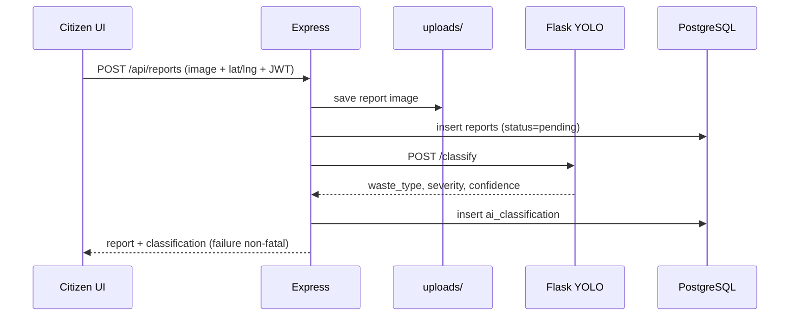
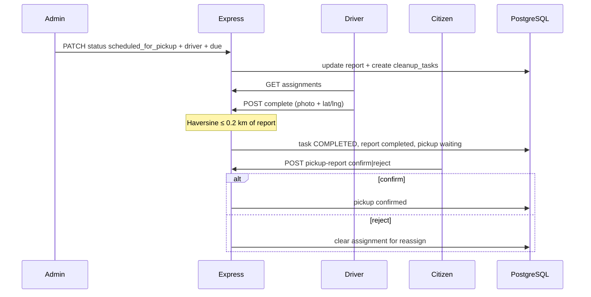

---
tags:
  - cleanai
  - architecture
  - data-flow
---

# Data Flow

## Citizen report submission

## Admin schedule → driver complete → citizen confirm

## Storage locations

| Artifact | Location |
|----------|----------|
| Report photos | `backend/uploads/reports/` → `/uploads/reports/...` |
| Completion photos | `backend/uploads/completions/` |
| Structured data | Tables in [[Database]] |
| Model weights | `model/best.pt` (or `MODEL_URL` download) |

## Related

- [[System Architecture]]
- [[Report Workflow]]
- [[Reports API]]
- [[Drivers API]]
