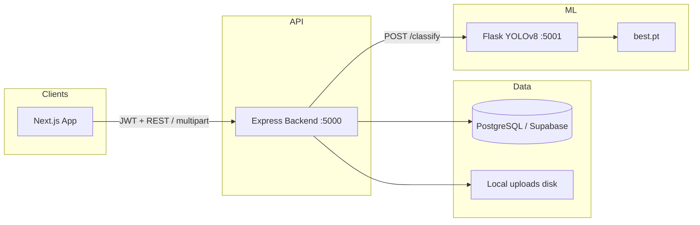

---
tags:
  - cleanai
  - architecture
---

# System Architecture

High-level layout of CleanAI as implemented in the repo.

## Layers

## Hosting (production shape)

| Service | Platform | Config |
|---------|----------|--------|
| Frontend | Vercel (typical) | Next.js app |
| `cleanai-backend` | Render | `render.yaml` · Node · `backend/` |
| `cleanai-ai` | Render | `render.yaml` · Python · `backend/ai-service/` |
| Database | Supabase PostgreSQL | `DATABASE_URL` |

## Key entry points

| Piece | Path |
|-------|------|
| Frontend app | `app/` (App Router) |
| API client | `lib/api-client.ts` |
| Express server | `backend/server.js` |
| DB pool | `backend/config/database.js` |
| Routes | `backend/routes/{auth,reports,users,alerts,drivers}.js` |
| Classifier | `backend/ai-service/classify.py` |
| Schema | `clean_ai_postgres.sql` |

## Security sketch

- Roles: `citizen` · `admin` · `driver` ([[Auth API]])
- Passwords: bcrypt
- Sessions: JWT Bearer (~24h), stored client-side as `authToken` + `user`
- CORS: `FRONTEND_URL` in production
- Uploads: image types, 10 MB cap, served from `/uploads`

## Related

- [[Data Flow]]
- [[Report Workflow]]
- [[Tech Stack]]
- [[Deployment]]
