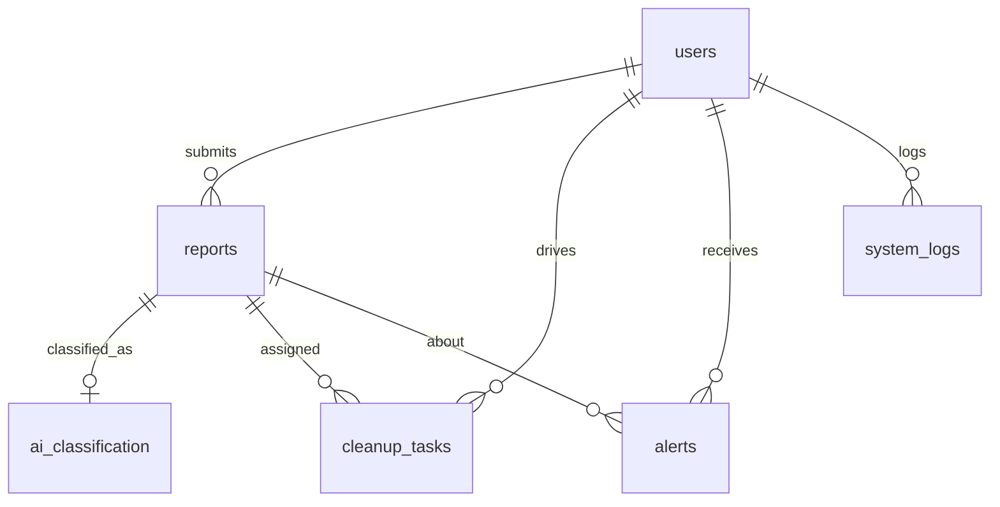

---
tags:
  - cleanai
  - stack
  - database
---

# Database

**Canonical schema:** `clean_ai_postgres.sql` (PostgreSQL / Supabase).

> Legacy MySQL dump `clean_ai.sql` and older XAMPP docs exist; prefer Postgres.

## Connection

Backend requires `DATABASE_URL` (Supabase URI). SSL is used for remote pools. `backend/config/database.js` shims MySQL-style `?` placeholders to Postgres `$1…n`.

## Tables

| Table | Role |
|-------|------|
| `users` | Citizens, admins, drivers (`role`, optional `area`) |
| `reports` | Waste submissions + status workflow |
| `ai_classification` | YOLO results per report |
| `cleanup_tasks` | Driver assignments + completion + pickup confirm |
| `alerts` | Notification records |
| `geospatial_zones` | Future zones |
| `satellite_verification` | Future satellite checks |
| `system_logs` | Auth / activity audit |

## ER sketch

## Important columns

### `reports.status`

See [[Report Workflow]].

### `cleanup_tasks`

- `completion_status` (e.g. `TASK DUE` → `COMPLETED`)
- `completion_image_url`, completion lat/lng
- `pickup_report_status` for citizen confirm/reject

## Seeds

Demo users are inserted in SQL — see [[Demo Accounts]].

## Related

- [[Backend]]
- [[Environment Variables]]
- [[Local Development]]
